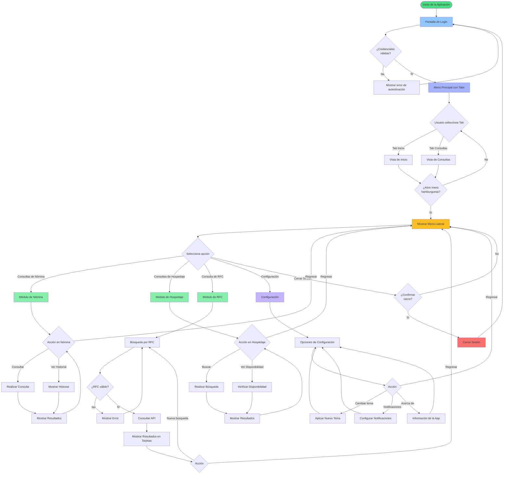
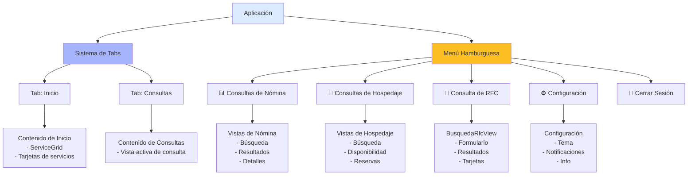
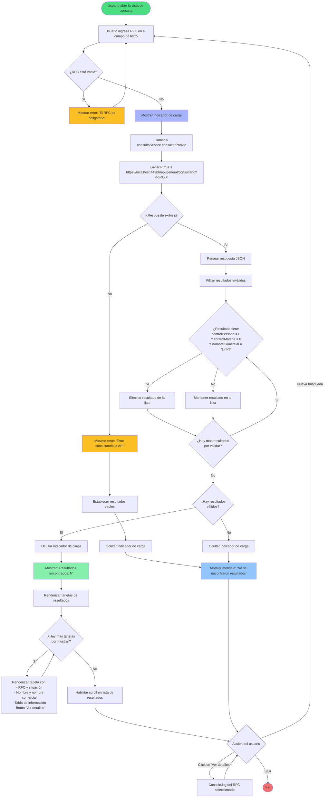
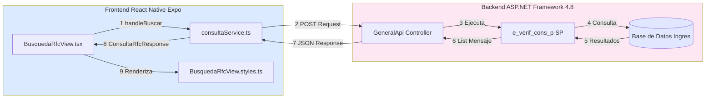
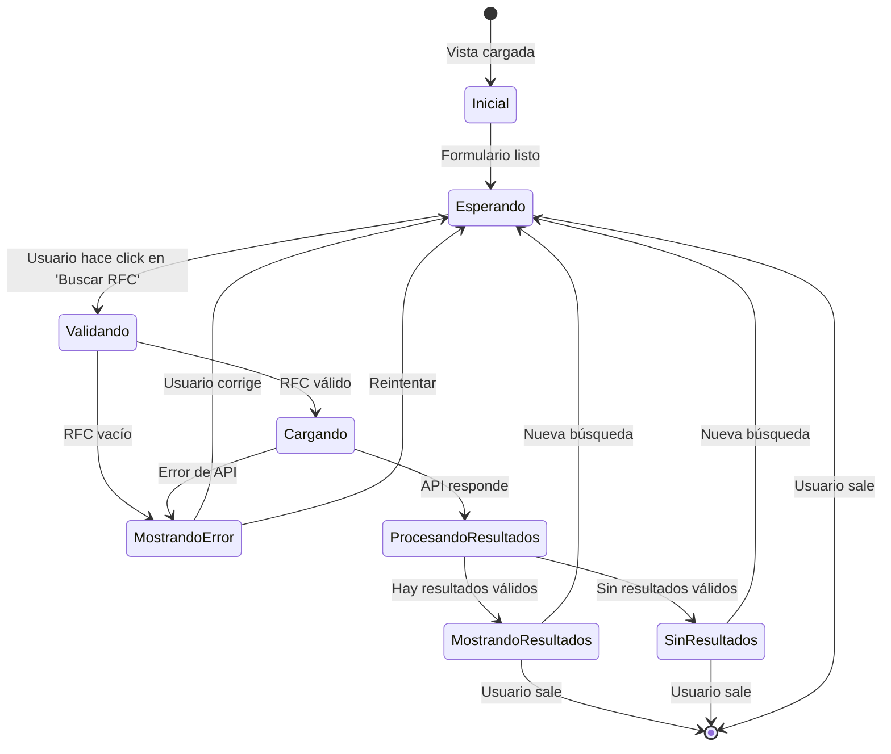
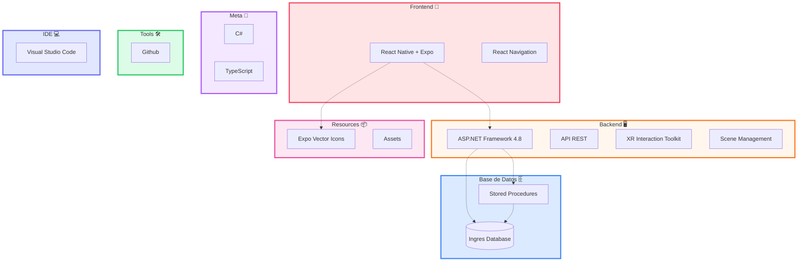
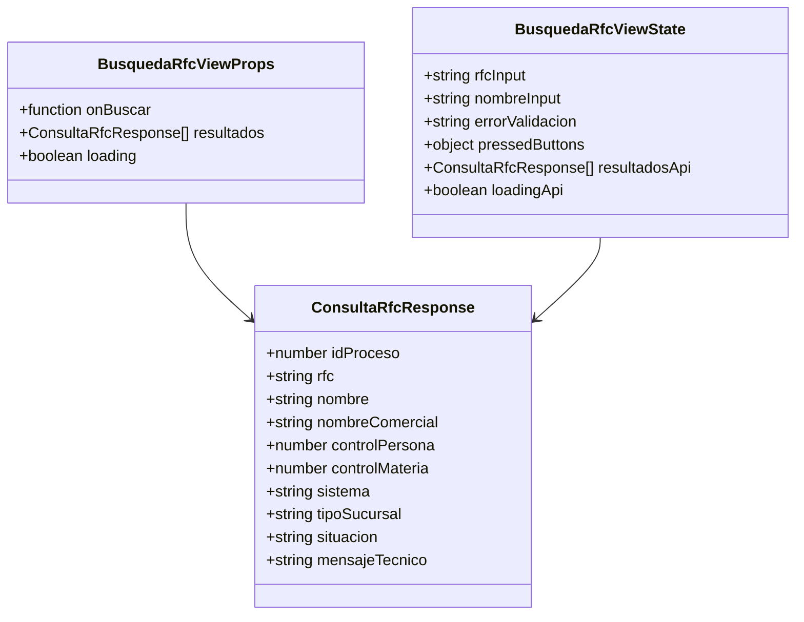

# Diagrama de Flujo - Aplicación Nómina y Hospedaje

## Descripción
Este documento contiene los diagramas de flujo de la aplicación móvil multiplataforma para gestión de nómina y hospedaje.

## Diagrama de Flujo General de la Aplicación

## Estructura del Menú de Navegación

## Diagrama de Flujo - Consulta de RFC (Detallado)

### Descripción
Este diagrama muestra el flujo específico de la funcionalidad de consulta de RFC.

## Diagrama de Flujo Principal

## Diagrama de Componentes y Servicios

## Diagrama de Estados de la Vista

## Stack Tecnológico

## Arquitectura de Capas

```mermaid
graph LR
    subgraph Capa1["Presentación 🎨"]
        direction TB
        Views[Views/Screens]
        Comp[Components]
        Styles[Styles]
    end
    
    subgraph Capa2["Lógica de Negocio 🧠"]
        direction TB
        Services[Services]
        Hooks[Custom Hooks]
        Utils[Utils]
    end
    
    subgraph Capa3["API Layer 🌐"]
        direction TB
        Controllers[Controllers]
        Models[Models]
        DTO[DTOs]
    end
    
    subgraph Capa4["Datos 💾"]
        direction TB
        DB[(Ingres DB)]
        SP2[Stored Procedures]
    end
    
    Capa1 --> Capa2
    Capa2 --> Capa3
    Capa3 --> Capa4
    
    style Capa1 fill:#dbeafe,stroke:#3b82f6,stroke-width:2px
    style Capa2 fill:#fce7f3,stroke:#ec4899,stroke-width:2px
    style Capa3 fill:#fff7ed,stroke:#f97316,stroke-width:2px
    style Capa4 fill:#dcfce7,stroke:#22c55e,stroke-width:2px
```

## Diagrama de Clases - Estructura de Datos

## Notas Técnicas

### Validaciones Implementadas:
1. **RFC vacío**: Se valida antes de hacer la petición
2. **Resultados inválidos**: Se filtran resultados con valores en 0 y "Link"
3. **Errores de API**: Se capturan y muestran al usuario

### Endpoints:
- **URL**: `https://localhost:44306/api/general/consultarfc`
- **Método**: POST
- **Parámetros**: `rfc` (query string)
- **Respuesta**: Array JSON de ConsultaRfcResponse

### Estados de la Interfaz:
- **Inicial**: Formulario vacío
- **Cargando**: Spinner mientras se consulta la API
- **Con Resultados**: Lista scrolleable de tarjetas
- **Sin Resultados**: Mensaje en tarjeta blanca con bordes redondeados
- **Error**: Mensaje de error debajo del input

---

**Última actualización**: 24 de octubre de 2025
**Versión**: 1.0
