# Diagrama de Flujo - Aplicación Nómina y Hospedaje

## Descripción
Este documento contiene los diagramas de flujo de la aplicación móvil multiplataforma para gestión de nómina y hospedaje.

## Diagrama de Flujo General de la Aplicación

```mermaid
flowchart TD
    Start([Inicio de la Aplicación]) --> Login[Pantalla de Login]
    Login --> ValidateCredentials{¿Credenciales<br/>válidas?}
    
    ValidateCredentials -->|No| ErrorLogin[Mostrar error de autenticación]
    ErrorLogin --> Login
    
    ValidateCredentials -->|Sí| MainMenu[Menú Principal con Tabs]
    
    MainMenu --> TabSelection{Usuario selecciona Tab}
    
    TabSelection -->|Tab Inicio| HomeView[Vista de Inicio]
    TabSelection -->|Tab Consultas| ConsultasView[Vista de Consultas]
    
    HomeView --> MenuHamburguesa{¿Abre menú<br/>hamburguesa?}
    ConsultasView --> MenuHamburguesa
    
    MenuHamburguesa -->|No| TabSelection
    
    MenuHamburguesa -->|Sí| ShowMenu[Mostrar Menú Lateral]
    
    ShowMenu --> MenuOption{Selecciona opción}
    
    MenuOption -->|Consultas de Nómina| NominaModule[Módulo de Nómina]
    MenuOption -->|Consultas de Hospedaje| HospedajeModule[Módulo de Hospedaje]
    MenuOption -->|Consulta de RFC| RfcModule[Módulo de RFC]
    MenuOption -->|Configuración| ConfigModule[Configuración]
    MenuOption -->|Cerrar Sesión| ConfirmLogout{¿Confirmar<br/>cierre?}
    
    ConfirmLogout -->|No| ShowMenu
    ConfirmLogout -->|Sí| Logout[Cerrar Sesión]
    Logout --> Login
    
    NominaModule --> NominaAction{Acción en Nómina}
    NominaAction -->|Consultar| QueryNomina[Realizar Consulta]
    NominaAction -->|Ver Historial| HistoryNomina[Mostrar Historial]
    NominaAction -->|Regresar| ShowMenu
    
    QueryNomina --> NominaResults[Mostrar Resultados]
    HistoryNomina --> NominaResults
    NominaResults --> NominaAction
    
    HospedajeModule --> HospedajeAction{Acción en Hospedaje}
    HospedajeAction -->|Buscar| QueryHospedaje[Realizar Búsqueda]
    HospedajeAction -->|Ver Disponibilidad| CheckAvailability[Verificar Disponibilidad]
    HospedajeAction -->|Regresar| ShowMenu
    
    QueryHospedaje --> HospedajeResults[Mostrar Resultados]
    CheckAvailability --> HospedajeResults
    HospedajeResults --> HospedajeAction
    
    RfcModule --> RfcSearch[Búsqueda por RFC]
    RfcSearch --> RfcValidation{¿RFC válido?}
    RfcValidation -->|No| RfcError[Mostrar Error]
    RfcError --> RfcSearch
    RfcValidation -->|Sí| RfcApiCall[Consultar API]
    RfcApiCall --> RfcResults[Mostrar Resultados en Tarjetas]
    RfcResults --> RfcAction{Acción}
    RfcAction -->|Nueva búsqueda| RfcSearch
    RfcAction -->|Regresar| ShowMenu
    
    ConfigModule --> ConfigOptions[Opciones de Configuración]
    ConfigOptions --> ConfigAction{Acción}
    ConfigAction -->|Cambiar tema| ChangeTheme[Aplicar Nuevo Tema]
    ConfigAction -->|Notificaciones| NotifSettings[Configurar Notificaciones]
    ConfigAction -->|Acerca de| AboutApp[Información de la App]
    ConfigAction -->|Regresar| ShowMenu
    
    ChangeTheme --> ConfigOptions
    NotifSettings --> ConfigOptions
    AboutApp --> ConfigOptions
    
    style Start fill:#4ade80
    style Login fill:#93c5fd
    style MainMenu fill:#a5b4fc
    style ShowMenu fill:#fbbf24
    style NominaModule fill:#86efac
    style HospedajeModule fill:#86efac
    style RfcModule fill:#86efac
    style ConfigModule fill:#c4b5fd
    style Logout fill:#f87171
```

## Estructura del Menú de Navegación

```mermaid
flowchart TD
    App[Aplicación] --> Tabs[Sistema de Tabs]
    
    Tabs --> Tab1[Tab: Inicio]
    Tabs --> Tab2[Tab: Consultas]
    
    App --> Hamburger[Menú Hamburguesa]
    
    Hamburger --> Option1[📊 Consultas de Nómina]
    Hamburger --> Option2[🏨 Consultas de Hospedaje]
    Hamburger --> Option3[📄 Consulta de RFC]
    Hamburger --> Option4[⚙️ Configuración]
    Hamburger --> Option5[🚪 Cerrar Sesión]
    
    Tab1 --> HomeContent[Contenido de Inicio<br/>- ServiceGrid<br/>- Tarjetas de servicios]
    Tab2 --> ConsultasContent[Contenido de Consultas<br/>- Vista activa de consulta]
    
    Option1 --> NominaViews[Vistas de Nómina<br/>- Búsqueda<br/>- Resultados<br/>- Detalles]
    Option2 --> HospedajeViews[Vistas de Hospedaje<br/>- Búsqueda<br/>- Disponibilidad<br/>- Reservas]
    Option3 --> RfcViews[BusquedaRfcView<br/>- Formulario<br/>- Resultados<br/>- Tarjetas]
    Option4 --> ConfigViews[Configuración<br/>- Tema<br/>- Notificaciones<br/>- Info]
    
    style App fill:#dbeafe
    style Hamburger fill:#fbbf24
    style Tabs fill:#a5b4fc
```

## Diagrama de Flujo - Consulta de RFC (Detallado)

### Descripción
Este diagrama muestra el flujo específico de la funcionalidad de consulta de RFC.

## Diagrama de Flujo Principal

```mermaid
flowchart TD
    Start([Usuario abre la vista de consulta]) --> Input[Usuario ingresa RFC en el campo de texto]
    Input --> ValidateEmpty{¿RFC está vacío?}
    
    ValidateEmpty -->|Sí| ErrorEmpty[Mostrar error: 'El RFC es obligatorio']
    ErrorEmpty --> Input
    
    ValidateEmpty -->|No| Loading[Mostrar indicador de carga]
    Loading --> CallAPI[Llamar a consultaService.consultarPorRfc]
    
    CallAPI --> APIRequest[Enviar POST a https://localhost:44306/api/general/consultarfc?rfc=XXX]
    
    APIRequest --> APIResponse{¿Respuesta exitosa?}
    
    APIResponse -->|No| ErrorAPI[Mostrar error: 'Error consultando la API']
    ErrorAPI --> EmptyResults[Establecer resultados vacíos]
    EmptyResults --> HideLoading1[Ocultar indicador de carga]
    HideLoading1 --> ShowEmptyMessage[Mostrar mensaje: 'No se encontraron resultados']
    
    APIResponse -->|Sí| ParseJSON[Parsear respuesta JSON]
    ParseJSON --> FilterResults[Filtrar resultados inválidos]
    
    FilterResults --> CheckInvalid{¿Resultado tiene<br/>controlPersona = 0<br/>Y controlMateria = 0<br/>Y nombreComercial = 'Link'?}
    
    CheckInvalid -->|Sí| RemoveResult[Eliminar resultado de la lista]
    CheckInvalid -->|No| KeepResult[Mantener resultado en la lista]
    
    RemoveResult --> MoreResults{¿Hay más resultados<br/>por validar?}
    KeepResult --> MoreResults
    
    MoreResults -->|Sí| CheckInvalid
    MoreResults -->|No| ValidResults{¿Hay resultados<br/>válidos?}
    
    ValidResults -->|No| HideLoading2[Ocultar indicador de carga]
    HideLoading2 --> ShowEmptyMessage
    
    ValidResults -->|Sí| HideLoading3[Ocultar indicador de carga]
    HideLoading3 --> DisplayCount[Mostrar: 'Resultados encontrados: N']
    
    DisplayCount --> RenderCards[Renderizar tarjetas de resultados]
    RenderCards --> CardLoop{¿Hay más tarjetas<br/>por mostrar?}
    
    CardLoop -->|Sí| RenderCard[Renderizar tarjeta con:<br/>- RFC y situación<br/>- Nombre y nombre comercial<br/>- Tabla de información<br/>- Botón 'Ver detalles']
    RenderCard --> CardLoop
    
    CardLoop -->|No| EnableScroll[Habilitar scroll en lista de resultados]
    EnableScroll --> UserInteraction{Acción del usuario}
    
    UserInteraction -->|Click en 'Ver detalles'| LogDetails[Console.log del RFC seleccionado]
    LogDetails --> UserInteraction
    
    UserInteraction -->|Nueva búsqueda| Input
    UserInteraction -->|Salir| End([Fin])
    
    ShowEmptyMessage --> UserInteraction

    style Start fill:#4ade80
    style End fill:#f87171
    style ErrorEmpty fill:#fbbf24
    style ErrorAPI fill:#fbbf24
    style ShowEmptyMessage fill:#93c5fd
    style DisplayCount fill:#86efac
    style Loading fill:#a5b4fc
```

## Diagrama de Componentes y Servicios

## Diagrama de Estados de la Vista

## Stack Tecnológico

## Arquitectura de Capas

```mermaid
graph LR
    subgraph Capa1["Presentación 🎨"]
        direction TB
        Views[Views/Screens]
        Comp[Components]
        Styles[Styles]
    end
    
    subgraph Capa2["Lógica de Negocio 🧠"]
        direction TB
        Services[Services]
        Hooks[Custom Hooks]
        Utils[Utils]
    end
    
    subgraph Capa3["API Layer 🌐"]
        direction TB
        Controllers[Controllers]
        Models[Models]
        DTO[DTOs]
    end
    
    subgraph Capa4["Datos 💾"]
        direction TB
        DB[(Ingres DB)]
        SP2[Stored Procedures]
    end
    
    Capa1 --> Capa2
    Capa2 --> Capa3
    Capa3 --> Capa4
    
    style Capa1 fill:#dbeafe,stroke:#3b82f6,stroke-width:2px
    style Capa2 fill:#fce7f3,stroke:#ec4899,stroke-width:2px
    style Capa3 fill:#fff7ed,stroke:#f97316,stroke-width:2px
    style Capa4 fill:#dcfce7,stroke:#22c55e,stroke-width:2px
```

## Diagrama de Clases - Estructura de Datos

## Notas Técnicas

### Validaciones Implementadas:
1. **RFC vacío**: Se valida antes de hacer la petición
2. **Resultados inválidos**: Se filtran resultados con valores en 0 y "Link"
3. **Errores de API**: Se capturan y muestran al usuario

### Endpoints:
- **URL**: `https://localhost:44306/api/general/consultarfc`
- **Método**: POST
- **Parámetros**: `rfc` (query string)
- **Respuesta**: Array JSON de ConsultaRfcResponse

### Estados de la Interfaz:
- **Inicial**: Formulario vacío
- **Cargando**: Spinner mientras se consulta la API
- **Con Resultados**: Lista scrolleable de tarjetas
- **Sin Resultados**: Mensaje en tarjeta blanca con bordes redondeados
- **Error**: Mensaje de error debajo del input

---

**Última actualización**: 24 de octubre de 2025
**Versión**: 1.0
